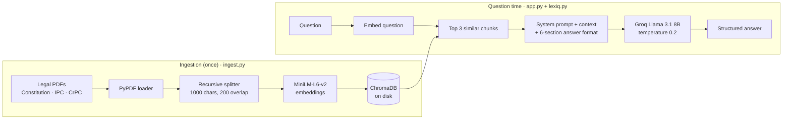

<div align="center">

# ⚖️ LexIQ

### A retrieval-augmented legal research assistant for Indian law

**Ask a legal question in plain English. LexIQ finds the relevant passages in the Constitution, the IPC and the
CrPC, and answers in a structured, citation-first format grounded in those texts.**


[](LICENSE)

</div>

> **Disclaimer:** LexIQ is for study and quick reference only. It is not legal advice. Verify important
> information against the primary source or consult a qualified advocate.

---

## Why LexIQ

General chatbots answer legal questions from memory, which leads to wrong section numbers and invented case
law. LexIQ uses **retrieval-augmented generation (RAG)**: every answer is built from passages retrieved from the
actual bare acts, and the model is instructed to say so when the retrieved text does not cover the question
instead of guessing.

## Features
- 💬 **Plain-English questions** about Indian criminal and constitutional law
- 📚 **Local legal corpus**: Constitution of India, Indian Penal Code (1860), Code of Criminal Procedure
- 🔎 **Semantic search** with local embeddings (`all-MiniLM-L6-v2`, runs on CPU, no API cost)
- 🧾 **Structured answers** in six fixed sections, with "no case law found in the available context" when that
  is the truth
- ➕ **Extensible**: drop a new PDF in `docs/`, add it to the list, re-run ingestion
- 🛡️ Safe rendering (model output is HTML-escaped), clear errors for a missing key or an empty index

## Architecture



### Answer format
Every answer follows the same structure, so it reads like a legal note:

1. Legal definition / overview
2. Relevant sections and citation
3. Key elements / conditions / ingredients
4. Important case law / judicial interpretation
5. Example / illustration
6. Summary in simple terms

## Tech stack

| Layer | Technology |
|---|---|
| UI | Streamlit |
| Orchestration | LangChain (loaders, text splitter, vector store wrappers) |
| Embeddings | sentence-transformers `all-MiniLM-L6-v2` (local, CPU) |
| Vector store | ChromaDB (persistent, local) |
| LLM | Groq API, Llama `llama-3.1-8b-instant` |
| PDF parsing | pypdf |

## Getting started

**Requirements:** Python 3.11+, a free Groq API key from https://console.groq.com/keys

```bash
git clone https://github.com/ChetanMahajan715/lexiq-ai-legal-assistant.git
cd lexiq-ai-legal-assistant
python -m venv venv
# Windows: venv\Scripts\activate    macOS / Linux: source venv/bin/activate
pip install -r requirements.txt

# Windows: copy .env.example .env    macOS / Linux: cp .env.example .env
# then put your key in .env:  GROQ_API_KEY=...

python ingest.py          # builds the vector database (once)
streamlit run app.py      # http://localhost:8501
```

### Try asking
```text
What is the punishment for theft under IPC?
What are the fundamental rights under the Constitution of India?
What happens after an FIR is filed?
```

## Adding documents

Put a text-based PDF in `docs/`, add it to `PDF_FILES` in `ingest.py`, and run `python ingest.py` again.
Scanned (image-only) PDFs need OCR first.

## Project structure

```
lexiq-ai-legal-assistant/
├── app.py            # Streamlit UI, Groq client, loading the pipeline
├── lexiq.py          # retrieval + prompt assembly + answer generation
├── prompts.py        # system prompt and the 6-section answer format
├── ingest.py         # PDF loading, chunking, embedding, ChromaDB build
├── docs/             # source legal PDFs
├── .streamlit/       # Streamlit theme
├── .env.example      # GROQ_API_KEY
├── requirements.txt
└── pyproject.toml
```

Secrets (`.env`), virtual environments and the generated ChromaDB folder are excluded by `.gitignore`.

## Possible improvements
- Show the retrieved source passages and page numbers under each answer
- Add the new criminal laws (Bharatiya Nyaya Sanhita, 2023 and BNSS) alongside IPC / CrPC
- Re-ranking and hybrid (keyword + vector) search for exact section-number queries
- Use the stored chat history for follow-up questions

## Author

**Chetan Mahajan** · AI / ML engineer

[](https://github.com/ChetanMahajan715)
[](https://www.linkedin.com/in/chetanmahajan715/)

## License
[Apache 2.0](LICENSE)
